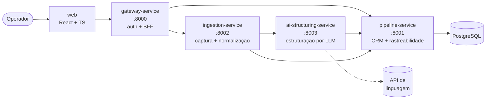
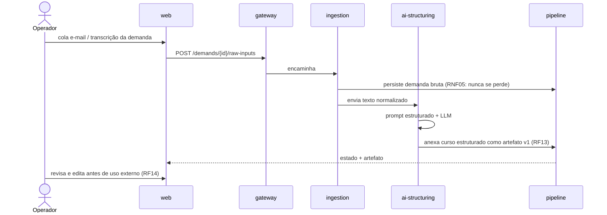

# Plataforma Inteligente de Cursos Corporativos

> Consolidação, rastreabilidade e estruturação por IA do processo de venda e produção de cursos corporativos sob demanda.

**Projeto Integrador de Extensão IV** · Curso IA/CD · Equipe de 6 · Ago–Nov/2026

teste
---

## O problema

Hoje o processo inteiro — relacionamento, entendimento da demanda, montagem do produto, proposta e
apresentação — está centralizado em **um único profissional** e espalhado por canais desconectados
(presencial, e-mail, videochamada, WhatsApp, Canva). São montadas 2 a 3 propostas por dia, manualmente.
Não existe um lugar único que consolide o que está acontecendo em cada negociação.

## A solução (MVP)

Dois pilares complementares:

| Pilar | O quê | Por quê |
|---|---|---|
| **1. Plataforma / CRM de processos** | Lugar único que consolida clientes, demandas e o andamento de cada negociação, com rastreabilidade ponta a ponta. | É a **entrega de valor** central. |
| **2. Estruturação por IA** | Camada que transforma entradas não estruturadas (e-mail, transcrição, mensagens) em produto de curso organizado. | É o **núcleo inteligente** que diferencia de um CRM genérico. |

> A IA gera e estrutura; **o humano valida antes de qualquer uso externo** (RF14).

**Fora do escopo do MVP:** motor de custeio, busca de instrutores, geração de slides, integrações
externas (e-mail/LinkedIn). Ver [Evoluções futuras](docs/00-produto/escopo-mvp.md#fora-do-escopo-do-mvp).

---

## Arquitetura



| Serviço | Responsabilidade | Requisitos que atende |
|---|---|---|
| [`gateway-service`](services/gateway-service) | Porta de entrada única, autenticação, roteamento para os serviços internos. | RF16, RF17, RNF10 |
| [`ingestion-service`](services/ingestion-service) | Recebe a demanda bruta heterogênea, normaliza e prepara para a camada de IA. | RF09, RF10, RNF05 |
| [`ai-structuring-service`](services/ai-structuring-service) | Extrai requisitos e gera ementa via LLM, com schema de saída fixo e métricas de qualidade. | RF11, RF12, RNF03, RNF04, RNF05, RNF06 |
| [`pipeline-service`](services/pipeline-service) | CRM: clientes, demandas, etapas, histórico, artefatos versionados. Dono do banco. | RF01–RF08, RF13, RF15, RNF07, RNF08, RNF09 |
| [`web`](web) | Interface do operador. | RF03, RF04, RF05, RF14, RF17 |

Detalhes e justificativas: [docs/02-arquitetura/visao-geral.md](docs/02-arquitetura/visao-geral.md)
e os [ADRs](docs/02-arquitetura/decisoes).

### Fluxo principal (end-to-end)



---

## Estrutura do repositório

```
.
├── docs/            Documentação do projeto (produto, requisitos, arquitetura, dados, IA, processo, entregas)
├── services/        Microsserviços backend (Python + FastAPI)
│   ├── gateway-service/
│   ├── ingestion-service/
│   ├── ai-structuring-service/
│   └── pipeline-service/
├── web/             Frontend (React + TypeScript + Vite)
├── packages/
│   └── contracts/   Contratos de API versionados e compartilhados (RNF02)
├── infra/           Docker, scripts de banco e utilitários de ambiente
├── tests/           Testes end-to-end entre serviços
└── .github/         CI, templates de issue e de pull request
```

---

## Stack

| Camada | Tecnologia | Motivo |
|---|---|---|
| Backend | Python 3.12 + FastAPI | Domínio da equipe (curso IA/CD); Pydantic dá schema de saída forte para a IA (RNF03). |
| Banco | PostgreSQL 16 + SQLAlchemy + Alembic | Integridade referencial e trilha de auditoria (RNF08, RNF09). |
| Frontend | React 18 + TypeScript + Vite | Ecossistema conhecido, build leve, deploy em camada gratuita (RNF12). |
| IA | API de LLM com prompts estruturados | Núcleo inteligente (Pilar 2). |
| Orquestração local | Docker Compose | Ambiente reproduzível para os 6 integrantes. |

Justificativa completa em [ADR-0002](docs/02-arquitetura/decisoes/ADR-0002-stack-tecnologica.md).

---

## Estado atual

> ⚠️ **Fase de scaffolding.** A estrutura, os contratos e a documentação estão montados;
> **os módulos ainda não têm implementação** — cada arquivo `.py` traz sua responsabilidade
> documentada e `TODO` apontando o requisito que deve atender. O `docker compose up` ainda
> **não sobe** os serviços. A implementação começa na Fase 3 (16/09), conforme o cronograma.

Acompanhe o avanço em [docs/01-requisitos/matriz-rastreabilidade.md](docs/01-requisitos/matriz-rastreabilidade.md).

---

## Como rodar (quando houver implementação)

Pré-requisitos: Docker Desktop, Python 3.12+, Node 20+.

```bash
cp .env.example .env      # preencha os valores locais (nunca versione o .env)
docker compose up -d db   # sobe apenas o PostgreSQL
make install              # dependências de todos os serviços + web
make dev                  # sobe os 4 serviços e o frontend
```

Comandos disponíveis: `make help`.

---

## Documentação

| Pasta | Conteúdo |
|---|---|
| [00-produto](docs/00-produto) | Escopo do MVP, modelo de negócio, 5W2H, cronograma. |
| [01-requisitos](docs/01-requisitos) | RF/RNF detalhados, matriz de rastreabilidade, glossário, questões em aberto. |
| [02-arquitetura](docs/02-arquitetura) | Visão geral, diagramas, contratos de API e ADRs. |
| [03-dados](docs/03-dados) | Modelo de dados e dicionário de dados. |
| [04-ia](docs/04-ia) | Estratégia de estruturação, schema de saída, catálogo de prompts, métricas de qualidade. |
| [05-processo](docs/05-processo) | Fluxo Git, Definition of Done, padrões de código, setup de ambiente. |
| [06-entregas](docs/06-entregas) | Checklists das quatro entregas parciais. |

---

## Equipe e frentes

| Frente | Integrantes | Responsabilidade principal |
|---|---|---|
| Gerência | 1 | Cronograma, board, cliente, entregas parciais. |
| Documentação | 1 | Requisitos, relatório técnico, artigos. |
| Backend | 2 | `pipeline-service`, `ingestion-service`, `gateway-service`, banco. |
| IA | 1 | `ai-structuring-service`, prompts, métricas de qualidade. |
| Frontend | 2 | `web`. |

> Preencha os nomes em [docs/05-processo/equipe.md](docs/05-processo/equipe.md) e em [`.github/CODEOWNERS`](.github/CODEOWNERS).

## Marcos

| Data | Entrega |
|---|---|
| 25/08 | M1 — Problema, escopo, requisitos e plano de ação. |
| 15/09 | M2 — Modelagem de dados, arquitetura e PoC da estruturação por IA. |
| 22/09 | Pré-banca. |
| 20/10 | M3 — Backend e pipeline funcionais, IA integrada, métricas e custos. |
| 17/11 | M4 — MVP funcional end-to-end. |
| 24/11 | Banca final. |

## Como contribuir

Fluxo obrigatório **Card → Branch → Commits → Pull Request → Review → Merge** (RNF14).
Leia [CONTRIBUTING.md](CONTRIBUTING.md) antes do primeiro commit.
