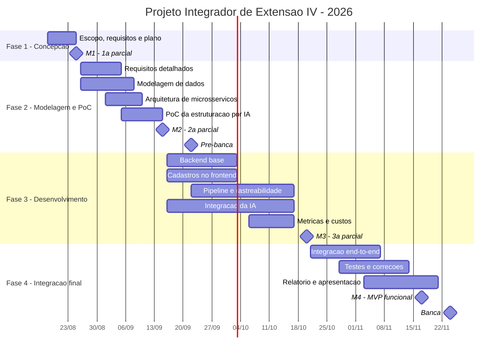

# Cronograma e marcos

## Marcos

| Marco | Data | Critério de conclusão |
|---|---|---|
| **M1** | 25/08 | Problema, público, escopo, requisitos e plano de ação (5W2H) submetidos. |
| **M2** | 15/09 | Requisitos detalhados, modelagem de dados, arquitetura de microsserviços e PoC da estruturação por IA. |
| **Pré-banca** | 22/09 | Validação intermediária com a banca. |
| **M3** | 20/10 | Backend e pipeline funcionais, módulo de estruturação integrado, métricas de qualidade e levantamento de custos. |
| **M4** | 17/11 | Microsserviços integrados e MVP funcional end-to-end. |
| **Banca** | 24/11 | Apresentação final. |

## Método

Scrum com entregas semanais. Controle via GitHub Projects e Insights; fluxo
**Card → Branch → Commits → Pull Request → Review → Merge**.

Checklists por entrega em [06-entregas](../06-entregas).
