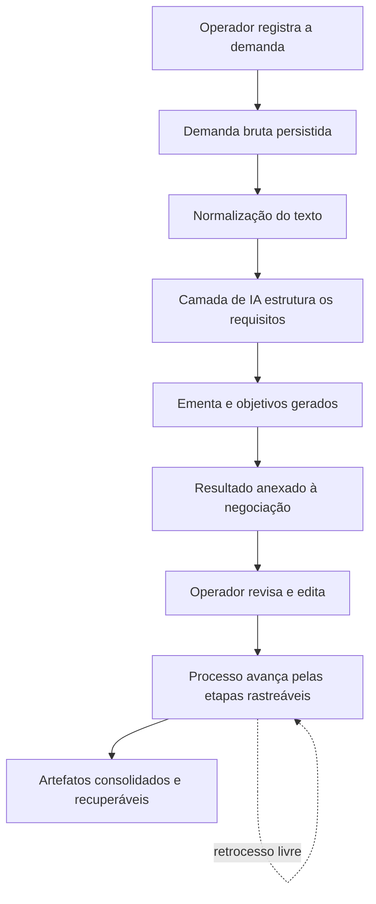

# Escopo do MVP

## Objetivo

Desenvolver uma plataforma web, no estilo CRM, que consolide em um único lugar todo o processo de
venda e produção de cursos corporativos sob demanda, com rastreabilidade completa das etapas e
estruturação por IA de demandas captadas de forma não estruturada.

## Problema

A empresa cliente vende cursos rápidos e altamente personalizados para outras empresas. Hoje o
processo inteiro — relacionamento, entendimento da demanda, montagem do produto, proposta e
apresentação — está centralizado em **um único profissional** e espalhado por canais desconectados
(presencial, e-mail, videochamada, WhatsApp, Canva).

Não existe um lugar único que consolide o que está acontecendo em cada negociação. O resultado é
acompanhamento difícil, retrabalho e um processo dependente da memória e da capacidade de uma só
pessoa. **São montadas 2 a 3 propostas por dia, manualmente.**

## Proposta de valor

Transformar um processo artesanal e fragmentado em um fluxo consolidado, rastreável e organizado,
com uma **fonte única de verdade**. O profissional deixa de administrar informação espalhada e passa
a orquestrar e revisar o processo dentro da plataforma, ganhando escala sem perder a personalização
que diferencia o negócio.

## Os dois pilares

### Pilar 1 — Plataforma / CRM de processos (entrega de valor)

O lugar único que consolida clientes, demandas e o andamento de cada negociação, com rastreabilidade
de ponta a ponta.

### Pilar 2 — Estruturação de cursos por IA (núcleo inteligente)

A camada que transforma entradas não estruturadas em um produto de curso organizado, diferenciando a
plataforma de um CRM genérico.

> Os pilares são complementares: a plataforma entrega o valor de consolidação; a IA qualifica o
> sistema como solução inteligente.

## Funcionalidades incluídas

| Funcionalidade | Descrição | Requisitos |
|---|---|---|
| Cadastro de clientes e demandas | Cada empresa e cada negociação registradas como itens navegáveis. | RF01–RF04 |
| Pipeline com rastreabilidade | Etapas visíveis (captação → estruturação → produto → proposta → acompanhamento), com histórico e **retrocesso livre** quando o cliente muda escopo. | RF05–RF08 |
| Ingestão de demanda heterogênea | Entrada de texto livre (e-mail colado, transcrição, mensagens) por captação padronizada. | RF09, RF10 |
| Estruturação inteligente do curso | Extração de tema, nicho, público-alvo, nº de participantes, carga horária e formato; geração de ementa com objetivos de aprendizagem. | RF11–RF14 |
| Consolidação documental | Todo artefato fica atrelado à negociação, versionado e recuperável. | RF15 |
| Acesso e operação | Autenticação e feedback de execução durante a estruturação. | RF16, RF17 |

## Fora do escopo do MVP

Adiado explicitamente **por depender de dados ou integrações ainda indisponíveis** — evitando
prometer o que não há base para sustentar:

| Item | Motivo |
|---|---|
| Motor de custeio / orçamento | O custo é hoje definido de forma tácita e caso a caso. **Não existe base de custo modelável.** |
| Busca automatizada de instrutores | Depende de fontes e integrações externas. |
| Geração automática da apresentação comercial (slides) | Depende do produto estruturado estar consolidado primeiro. |
| Integrações externas (e-mail, LinkedIn) e automação de prospecção | Exigem gestão segura de credenciais de terceiros (OAuth). |

> **Nota de reposicionamento.** O custeio era previsto como núcleo do projeto e foi movido para
> evolução futura após a constatação de que não existe base de custo modelável — a estimativa é hoje
> tácita e humana. Sem essa fundação (RNF-F1), não se promete faixa orçamentária.

Evoluções futuras estão registradas como `RF-F*` e `RNF-F*` em
[requisitos-funcionais.md](../01-requisitos/requisitos-funcionais.md#bloco-b--evoluções-futuras).
Elas não são implementadas nesta disciplina, mas justificam a decisão de manter os serviços
desacoplados (RNF13).

## Fluxo do MVP

**A IA gera e estrutura; o humano valida antes de qualquer uso externo.**

## Possíveis artigos científicos

1. Estruturação automática de requisitos de treinamento a partir de linguagem natural heterogênea.
2. Plataforma de rastreabilidade de processos comerciais com apoio de agentes de IA.
3. Redução de gargalo operacional em processos centralizados por meio de consolidação e IA aplicada.
