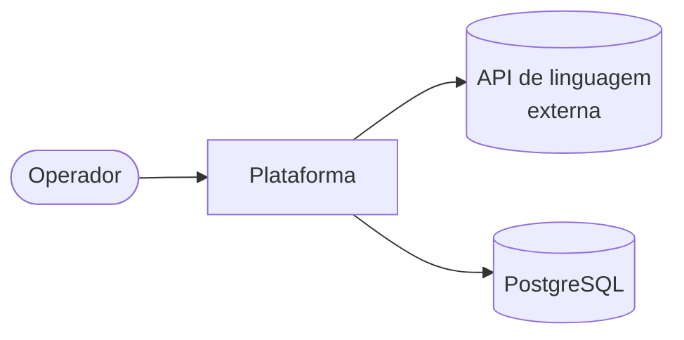
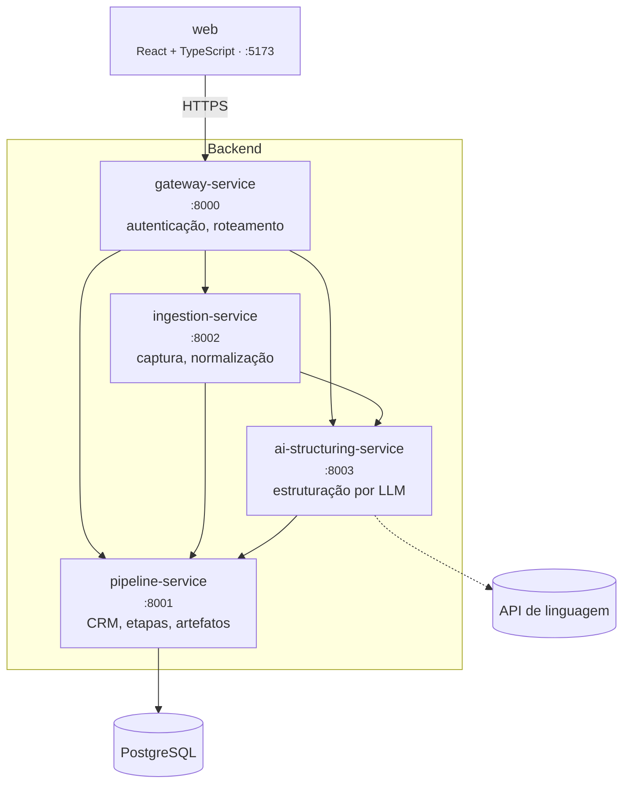

# Visão geral da arquitetura

Atende **RNF01** (microsserviços independentes comunicando-se por API) e **RNF13** (serviços
desacoplados, evolução independente sem reescrita do núcleo).

## Contexto



O sistema tem **um tipo de usuário** — o operador que conduz relacionamento, produto e proposta — e
**uma dependência externa**: a API de linguagem, única despesa recorrente do projeto (RNF12).

## Serviços



| Serviço | Responsabilidade | Não é responsabilidade dele |
|---|---|---|
| **gateway-service** | Porta de entrada única. Autentica, roteia e propaga a identidade do usuário. | Regra de negócio. O gateway não decide nada sobre o domínio. |
| **ingestion-service** | Recebe a demanda bruta, **persiste antes de qualquer processamento**, normaliza e orquestra a estruturação. | Interpretar conteúdo — isso é do LLM. |
| **ai-structuring-service** | Monta prompts versionados, chama o LLM, valida a saída contra o schema e mede qualidade. | Persistir. Não tem banco próprio. |
| **pipeline-service** | Dono do domínio e do banco: clientes, demandas, etapas, histórico, artefatos e versões. | Falar com o LLM. |
| **web** | Interface do operador, incluindo a revisão humana da saída da IA. | Regra de negócio duplicada do backend. |

## Princípios

1. **Um serviço, um banco.** Só o `pipeline-service` acessa o PostgreSQL. Os outros pedem por API.
   Isso é o que permite evoluir um serviço sem quebrar os demais (RNF13).
2. **O bruto vem antes.** A demanda bruta é persistida **antes** da chamada ao LLM. Falha ou timeout
   do modelo não pode custar o texto que o operador colou (RNF05).
3. **Histórico é append-only.** Transições de etapa e versões de artefato só aceitam inserção.
   Não há UPDATE nem DELETE nessas tabelas (RNF09).
4. **Contrato antes de código.** Mudança de API começa em `packages/contracts` (RNF02).
5. **A IA propõe, o humano decide.** Nenhuma saída do LLM vai para uso externo sem revisão (RF14).
6. **Sem inventar infraestrutura.** Nada de fila, cache ou service mesh no MVP — custo e operação
   sem problema correspondente (RNF12).

## Fluxo end-to-end da estruturação

```mermaid
sequenceDiagram
    actor Op as Operador
    participant W as web
    participant G as gateway
    participant I as ingestion
    participant P as pipeline
    participant A as ai-structuring
    participant L as LLM

    Op->>W: cola o texto da demanda
    W->>G: POST /api/v1/ingestion/raw-demands
    G->>I: encaminha (com identidade do usuário)

    I->>P: persiste demanda bruta
    Note over I,P: RNF05 - a partir daqui nada se perde
    P-->>I: raw_input_id

    I->>I: normaliza o texto (RF10)
    I->>A: solicita estruturação
    A->>L: prompt versionado + schema
    L-->>A: resposta
    A->>A: valida contra o JSON Schema (RNF03)

    alt saída válida
        A->>P: anexa artefato v1 (RF13)
        A-->>I: curso estruturado
        I-->>W: concluída
        Op->>W: revisa e edita (RF14)
        W->>G: POST nova versão do artefato (RF08)
    else timeout ou saída inválida
        A-->>I: falha recuperável
        I-->>W: FALHA_ESTRUTURACAO
        Note over W: a demanda bruta continua registrada;<br/>o operador pode repetir sem recolar o texto
    end
```

## Decisões de arquitetura

| ADR | Decisão |
|---|---|
| [ADR-0001](decisoes/ADR-0001-arquitetura-microsservicos.md) | Arquitetura em microsserviços e divisão das fronteiras. |
| [ADR-0002](decisoes/ADR-0002-stack-tecnologica.md) | Stack: Python/FastAPI, PostgreSQL, React/TypeScript. |
| [ADR-0003](decisoes/ADR-0003-comunicacao-entre-servicos.md) | Comunicação síncrona por HTTP/REST no MVP. |
| [ADR-0004](decisoes/ADR-0004-banco-unico-com-dono.md) | Banco único, com o `pipeline-service` como dono exclusivo. |
| [ADR-0005](decisoes/ADR-0005-gateway-como-fronteira-de-autenticacao.md) | Autenticação concentrada no gateway. |
| [ADR-0006](decisoes/ADR-0006-saida-da-ia-com-schema-fixo.md) | Saída da IA validada contra JSON Schema versionado. |

## O que a arquitetura precisa suportar depois

O MVP não implementa custeio, busca de instrutores, geração de slides nem integrações externas.
A arquitetura foi desenhada para que cada um deles entre como **serviço novo**, consumindo o
`pipeline-service` por API — sem reescrever o núcleo (RNF13, RF-F1 a RF-F5).
