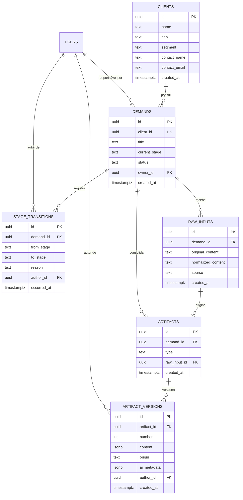
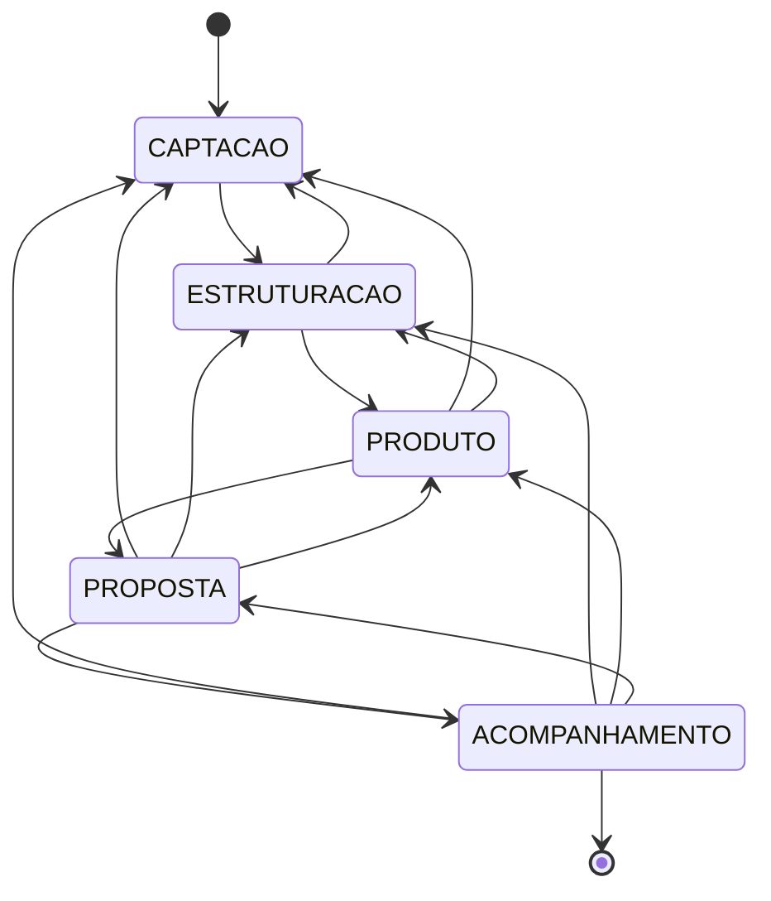

# Modelo de dados

Atende **RNF14 do Documento Consolidado de Requisitos v1.0** (integridade referencial entre
cliente, demanda, etapa, fonte e artefato). Esse requisito correspondia ao RNF08 na versão inicial
dos requisitos mantida neste repositório.

> **Estado:** implementado pela migration
> [`20260902_1200_enforce_referential_integrity.py`](../../services/pipeline-service/app/db/migrations/versions/20260902_1200_enforce_referential_integrity.py).
> O schema real é criado exclusivamente por migrations do Alembic — ver
> [ADR-0004](../02-arquitetura/decisoes/ADR-0004-banco-unico-com-dono.md).

## Entidade-relacionamento

## As entidades

| Entidade | O que é | Requisitos |
|---|---|---|
| `users` | Operador da plataforma. Sustenta a autoria da trilha de auditoria. | RF16 |
| `clients` | Empresa cliente. | RF01 |
| `demands` | Negociação vinculada a um cliente; percorre o pipeline. | RF02, RF05 |
| `raw_inputs` | Texto heterogêneo como chegou, mais sua versão normalizada. | RF09, RF10 |
| `stage_transitions` | Histórico imutável de mudanças de etapa. | RF07 |
| `artifacts` | Documento lógico atrelado à negociação. | RF15 |
| `artifact_versions` | Cada versão do conteúdo do artefato. | RF08 |

## Decisões de modelagem

### 1. Etapa corrente duplicada — de propósito

`demands.current_stage` repete o `to_stage` da última transição. É desnormalização deliberada: a
listagem de demandas (RF03) precisa filtrar por etapa dentro do alvo de 500 ms (RNF07) sem varrer o
histórico a cada consulta.

**Preço:** os dois campos podem divergir. **Mitigação:** gravar a transição e atualizar a etapa
corrente ocorre sempre na **mesma transação**, em um único lugar do código
(`pipeline_service.py`). Nenhuma rota atualiza `current_stage` diretamente.

### 2. Tabelas append-only

`stage_transitions` e `artifact_versions` **só aceitam INSERT**. Não há caminho de código que
atualize ou apague linha dessas tabelas — é assim que RNF09 deixa de ser promessa e vira propriedade
do sistema.

Recomendado reforçar no banco com `REVOKE UPDATE, DELETE` para o usuário da aplicação nessas duas
tabelas: a garantia deixa de depender de disciplina de código.

### 3. Conteúdo do artefato em `jsonb`

O curso estruturado tem forma definida ([`structured-course.schema.json`](../../packages/contracts/schemas/structured-course.schema.json)),
mas evoluirá durante a Fase 3. `jsonb` permite evoluir o conteúdo sem migration a cada ajuste de
campo, e o PostgreSQL ainda permite indexar e consultar dentro dele.

A validação do formato acontece na aplicação, contra o JSON Schema (RNF03) — não no banco.

### 4. Proveniência da IA gravada junto

`artifact_versions.ai_metadata` guarda modelo, versão de prompt, tokens e latência de cada geração.
Sem isso, nenhum resultado é reproduzível e as métricas de RNF04 não têm como ser recalculadas depois.

`artifact_versions.origin` distingue `IA` de `HUMANO` — é o que permite medir quanto o operador
precisou corrigir, principal indicador prático de qualidade da estruturação.

### 5. Nada é apagado

Cliente e demanda usam desativação lógica, nunca `DELETE`. Apagar um cliente levaria junto o
histórico das negociações dele — o oposto de RNF09 e de RF15.

### 6. Fonte e artefato pertencem à mesma demanda

Quando `artifacts.raw_input_id` é informado, a chave estrangeira composta
`(raw_input_id, demand_id)` garante que a fonte e o artefato pertençam à mesma demanda. Assim, não é
possível formar uma cadeia válida individualmente, mas inconsistente entre clientes ou demandas.

## Máquina de estados do pipeline

**Avanço** é sequencial: só para a etapa imediatamente seguinte. **Retrocesso** é livre para
qualquer etapa anterior (RF06) — o cliente muda escopo a qualquer momento, e isso é rotina do
negócio, não exceção. Todo retrocesso exige motivo, e toda transição é registrada (RF07).

Demanda com status diferente de `ABERTA` não muda de etapa.

## Índices previstos

| Tabela | Índice | Por quê |
|---|---|---|
| `demands` | `(client_id, status, created_at)` | Listagem filtrada de RF03 dentro do alvo de RNF07 |
| `demands` | `(current_stage)` | Visão de pipeline |
| `stage_transitions` | `(demand_id, occurred_at)` | Histórico cronológico de RF04 e RF07 |
| `artifact_versions` | `(artifact_id, number)` único | Garante numeração sequencial sem lacuna (RF08) |
| `raw_inputs` | `(demand_id, created_at)` | Recuperação do bruto |
| `clients` | `name` com `unaccent` | Busca de cliente sem acento (RF03) |

## Questões que afetam este modelo

- **[Q1](../01-requisitos/questoes-em-aberto.md#q1--revisão--versionamento-de-artefato)** — editar a
  saída da IA cria versão nova ou usa rascunho? Muda `artifact_versions`. **Fechar antes da Fase 3.**
- **[Q6](../01-requisitos/questoes-em-aberto.md#q6--papéis-de-usuário)** — quantos papéis de usuário?
  Muda `users`.
