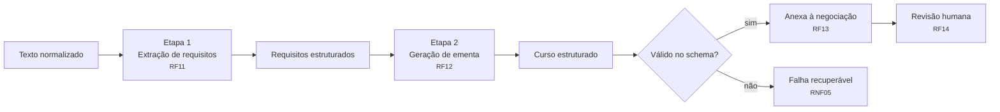

# Estratégia de estruturação por IA

O **núcleo inteligente** do MVP (Pilar 2): transformar entrada não estruturada em produto de curso
organizado. É o que diferencia a plataforma de um CRM genérico.

**Requisitos:** RF11, RF12, RF13, RF14, RNF03, RNF04, RNF05, RNF06.

## O problema

O operador recebe demanda por e-mail, reunião gravada e WhatsApp. O texto chega assim:

> "Oi, tudo bem? Conversei com o RH aqui e a gente precisava de um treinamento de liderança pro
> pessoal de coordenação, uns 25 gestores. Pensamos em algo de meio período, talvez 8h, pode ser
> online. É pra área industrial, então precisa falar a língua deles..."

E precisa virar: tema, nicho, público-alvo, número de participantes, carga horária, formato,
objetivos de aprendizagem e ementa modularizada.

**Por que não regra fixa:** não há padrão de formato, os campos aparecem em ordem arbitrária, muitos
ficam implícitos ("meio período" → 4h ou 8h?) e a linguagem é coloquial. Interpretação desse tipo
exige modelo de linguagem — é exatamente o que justifica a IA neste projeto.

## Abordagem: duas etapas encadeadas

**Por que separar em duas chamadas em vez de uma só:**

1. Extrair e criar são tarefas cognitivas diferentes. Extração deve ser conservadora (não inventar);
   geração precisa produzir conteúdo novo. Instruções opostas no mesmo prompt se atrapalham.
2. Se a extração falha, a ementa nem é tentada — economiza tokens (RNF12).
3. Cada etapa é medida separadamente (RNF04): acurácia de extração é objetiva contra gabarito;
   qualidade de ementa exige avaliação humana. Misturadas, não se sabe qual falhou.
4. O operador pode corrigir os requisitos extraídos e **regerar só a ementa**, sem refazer tudo.

**Preço:** duas chamadas custam mais tempo e mais tokens, pressionando o alvo de 15 s (RNF06).
A medir na PoC — se não couber no alvo, esta decisão é revista.

## Princípios

### 1. Não inventar

Campo sem base no texto vai para `campos_ausentes`. Nunca é preenchido com valor plausível.

Um modelo que "chuta" 8 horas quando o cliente não falou de duração produz uma proposta errada que
**parece** certa — o pior resultado possível. Reportar a ausência devolve a decisão ao operador
(RF14) e mantém a métrica de acurácia honesta (RNF04).

### 2. Saída sempre validada

Resposta que não passa no JSON Schema é falha, não é aceita "quase certa". Ver
[ADR-0006](../02-arquitetura/decisoes/ADR-0006-saida-da-ia-com-schema-fixo.md).

### 3. Prompt é artefato versionado

Vive em arquivo com sufixo de versão em
[`app/prompts/`](../../services/ai-structuring-service/app/prompts/README.md). Mudança gera `v2`,
nunca edição no lugar — sem isso, duas medições não são comparáveis.

### 4. Temperatura baixa

Estruturação não é tarefa criativa. Consistência (mesma entrada → mesma saída) é requisito explícito
de RNF03 e uma das métricas de RNF04.

### 5. O humano decide

Nenhuma saída vai para uso externo sem revisão (RF14). A IA acelera o trabalho do operador; não o
substitui. Esse é também o argumento de defesa do projeto: a personalização que diferencia o negócio
do cliente continua humana.

## Tratamento de falha (RNF05)

| Falha | Tratamento |
|---|---|
| Timeout do LLM | Falha recuperável. Bruto já persistido; operação repetível sem recolar o texto. |
| Erro da API (5xx, limite de taxa) | Retentativa com backoff, limitada por `LLM_MAX_RETRIES`. |
| Saída inválida no schema | Uma retentativa; persistindo, marca `FALHA_ESTRUTURACAO`. |
| Entrada vazia ou irrelevante | Erro de validação, sem chamar o LLM — não se gasta token à toa. |

Em **nenhum** desses casos a demanda bruta é perdida. Essa é a garantia central de RNF05, e ela vem
da ordem do fluxo: o `ingestion-service` persiste **antes** de chamar o LLM.

## Escolha do modelo

A definir na PoC da Fase 2 (05–15/09), medindo três eixos sobre o mesmo conjunto de avaliação:

| Eixo | Requisito |
|---|---|
| Acurácia de extração | RNF04 |
| Latência | RNF06 (≤ 15 s) |
| Custo por demanda | RNF12 |

O serviço fala com uma **interface de provedor**, não com um SDK específico: trocar de modelo ou de
fornecedor não deve alterar o resto do código.

Há também um provedor falso (`LLM_PROVIDER=mock`) para a CI e os testes rodarem sem chave e sem custo.

## O que fica fora

- **Ajuste fino (fine-tuning)** — não há volume de dados anotados nem justificativa de custo.
- **RAG / base vetorial** — não há corpus de conhecimento a consultar; a informação está toda no
  texto de entrada.
- **Agentes com múltiplos passos autônomos** — complexidade sem problema correspondente.
- **Geração de proposta e de slides** — RF-F2 e RF-F3, evolução futura.
