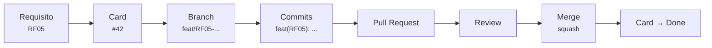

# Fluxo de trabalho no Git

Atende **RNF14** (fluxo Card → Branch → Commits → Pull Request → Review → Merge) e **RNF16**
(rastreabilidade requisito → card → sprint).



O ID do requisito atravessa todas as etapas. É isso — e não uma planilha à parte — que produz a
rastreabilidade exigida por RNF16.

## 1. Card

Todo trabalho começa por um card no GitHub Projects, criado a partir de um
[template de issue](../../.github/ISSUE_TEMPLATE).

```
[RF05] Avançar e retroceder etapas do pipeline
[RNF03] Definir schema de saída da estruturação por IA
```

**Labels:** `svc:pipeline`, `svc:ingestion`, `svc:ai`, `svc:gateway`, `svc:web`, `svc:contracts`,
`docs` · **Prioridade:** `essencial`, `alta`, `media`.

## 2. Branch

Uma branch por card, sempre a partir da `main` atualizada:

```
<tipo>/<ID>-<descricao-curta>
```

| Tipo | Uso |
|---|---|
| `feat` | Nova funcionalidade |
| `fix` | Correção de defeito |
| `docs` | Documentação |
| `refactor` | Refatoração sem mudança de comportamento |
| `test` | Apenas testes |
| `chore` | Infra, dependências, configuração |

```bash
git switch main && git pull
git switch -c feat/RF05-transicao-etapas
```

## 3. Commits

**Conventional Commits**, com o ID do requisito no escopo, mensagem em português, no imperativo:

```
feat(RF05): permitir retrocesso livre entre etapas do pipeline
fix(RNF05): preservar demanda bruta quando o LLM excede o timeout
docs(RNF04): definir critérios de acurácia da extração
```

Commits pequenos e coesos. Um commit que precisa de "e" na mensagem provavelmente são dois commits.

## 4. Pull Request

```bash
git push -u origin feat/RF05-transicao-etapas
gh pr create --fill
```

Preencha o [template](../../.github/pull_request_template.md) e vincule o card com `Closes #42` —
assim o card fecha sozinho no merge. **CI verde é pré-requisito para review.**

## 5. Review

| Situação | Aprovações |
|---|---|
| Mudança comum | 1 |
| Contrato de API (`packages/contracts`) ou modelo de dados | 2 |

O revisor verifica: atende ao requisito do card? tem teste? respeita o contrato? não vaza segredo?
não amplia o escopo do MVP por conta própria?

Comentário é sugestão até o autor responder. Discussão aberta bloqueia o merge.

**Revisar é trabalho, não favor.** PR parado é sprint parada — meta de resposta: mesmo dia útil.

## 6. Merge

- **Squash and merge**, mantendo a mensagem no padrão de commit.
- Branch apagada.
- Card movido para *Done*.
- [Matriz de rastreabilidade](../01-requisitos/matriz-rastreabilidade.md) atualizada — no mesmo PR,
  não depois.

## Regras da `main`

- Ninguém faz push direto. Tudo passa por PR.
- A `main` está sempre íntegra: o que estiver nela precisa subir.
- Conflito se resolve na branch, com `rebase` sobre a `main` atualizada:

```bash
git fetch origin && git rebase origin/main
```

## Sprints

Scrum com entregas semanais, alinhadas às quatro fases do
[plano de ação](../00-produto/plano-acao-5w2h.md). Controle por GitHub Projects e Insights.

| Ritual | Quando | Objetivo |
|---|---|---|
| Planejamento | Início da sprint | Puxar cards para a sprint; conferir se todo card tem ID de requisito |
| Acompanhamento | Meio da sprint | Destravar impedimento, não relatar status |
| Revisão | Fim da sprint | Demonstrar o que funciona; atualizar a matriz |
| Retrospectiva | Fim da sprint | Ajustar o processo |
